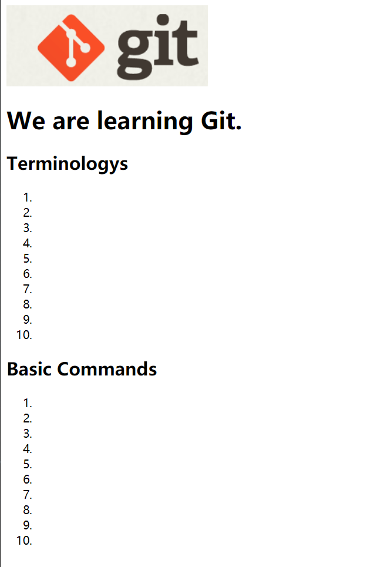
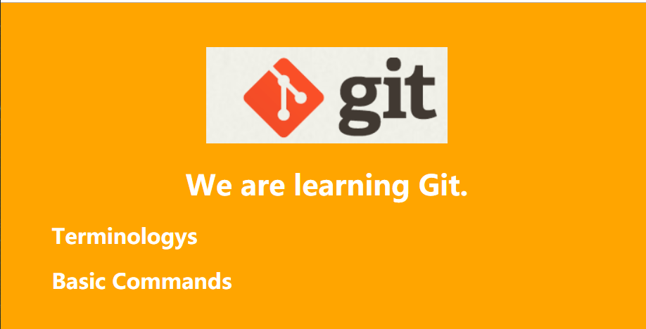

[TOC]

# 往仓库里添加文件

> 4 次提交，一个像模像样的静态页面生成了


## 课堂练习

> 练习的目的：熟悉git的提交流程

1. 加入`index.html`和`git-logo`
2. 加入`style.css`
3. 加入`scripts.js`
4. 修改`index.html`和`style.css`

```shell
# 下载稍后需要的文件，并解压
$ curl -O  "https://github.com/BoobooWei/DBA_Git/blob/master/info/git_learning_master_6_commits-27d2f8146eabcf2782e87ce445b8469cc1accc73.zip"

$ unzip git_learning_master_6_commits-27d2f8146eabcf2782e87ce445b8469cc1accc73.zip
$ git init git_learning
$ cd git_learning
$ ll -al
total 44
drwxr-xr-x 1 rgwei 197121 0 3月  10 13:07 ./
drwxr-xr-x 1 rgwei 197121 0 3月  10 13:28 ../
drwxr-xr-x 1 rgwei 197121 0 3月  10 13:07 .git/

# 复制index.html到git_learning目录中
$ cp ../git_learning_master_6_commits-27d2f8146eabcf2782e87ce445b8469cc1accc73/index.html index.html
# 复制images目录到git_learning目录中
$ cp -r ../git_learning_master_6_commits-27d2f8146eabcf2782e87ce445b8469cc1accc73/images/ .
$ ll
total 4
drwxr-xr-x 1 rgwei 197121    0 3月  10 13:35 images/
-rw-r--r-- 1 rgwei 197121 1303 3月  10 13:35 index.html

# 查看git仓库中存在没有被git管理的文件
$ git status
On branch master

Initial commit

Untracked files:
  (use "git add <file>..." to include in what will be committed)

        images/
        index.html

nothing added to commit but untracked files present (use "git add" to track)

# 通过git add命令使得git可以管理index.html和images文件
$ git add index.html images
warning: LF will be replaced by CRLF in index.html.
The file will have its original line endings in your working directory.

# 再次查看git管理情况
$ git status
On branch master

Initial commit

Changes to be committed:
  (use "git rm --cached <file>..." to unstage)

        new file:   images/git-logo.png
        new file:   index.html
# 看到已经将images和index.html添加到git仓库的暂存处
```

通过浏览器打开本地的index.html文件，如下图所示



```shell
# 创建styles目录
$ mkdir styles

# 将style.css复制到仓库中的styles目录下
$ cp ../git_learning_master_6_commits-27d2f8146eabcf2782e87ce445b8469cc1accc73/styles/style.css styles/

$ git status
On branch master

Initial commit

Changes to be committed:
  (use "git rm --cached <file>..." to unstage)

        new file:   images/git-logo.png
        new file:   index.html

Untracked files:
  (use "git add <file>..." to include in what will be committed)

        styles/
# 将styles目录添加到暂存区，让git管理起来
$ git add styles
warning: LF will be replaced by CRLF in styles/style.css.
The file will have its original line endings in your working directory.

$ git status
On branch master

Initial commit

Changes to be committed:
  (use "git rm --cached <file>..." to unstage)

        new file:   images/git-logo.png
        new file:   index.html
        new file:   styles/style.css

```

添加了css文件后，刷新网页



```shell
# 添加js目录
$ mkdir js

# 复制动画文件
$ cp ../git_learning_master_6_commits-27d2f8146eabcf2782e87ce445b8469cc1accc73/js/script.js js

$ git status
On branch master

Initial commit

Changes to be committed:
  (use "git rm --cached <file>..." to unstage)

        new file:   images/git-logo.png
        new file:   index.html
        new file:   styles/style.css

Untracked files:
  (use "git add <file>..." to include in what will be committed)

        js/


# 将js目录添加到暂存区
$ git add js
warning: LF will be replaced by CRLF in js/script.js.
The file will have its original line endings in your working directory.

# 查看状态
$ git status
On branch master

Initial commit

Changes to be committed:
  (use "git rm --cached <file>..." to unstage)

        new file:   images/git-logo.png
        new file:   index.html
        new file:   js/script.js
        new file:   styles/style.css

```

添加动画后，可以点击展开明细


```shell
# index.html 文件中增加的代码
<footer>
        <p>
            <a href="https://github.com/TTN-js/unforGITtable"> 参考项目 01</a> 
        </p>
</footer>

# style.css 文件中增加的代码

footer{
  right: 0;
  bottom: 0;
  position: relative;
  padding: 10px 1rem 10px 0;
  margin-top: 50px;
  font-size: 0.7em;
  text-align: right;
}

footer p{
  margin-bottom:0;
}

$ vim styles/style.css
$ vim index.html
$ git status
On branch master
Changes not staged for commit:
  (use "git add <file>..." to update what will be committed)
  (use "git checkout -- <file>..." to discard changes in working directory)

        modified:   index.html
        modified:   styles/style.css

no changes added to commit (use "git add" and/or "git commit -a")
# 将所有变更保存到暂存区
$ git add -u

$ git status
On branch master
Changes to be committed:
  (use "git reset HEAD <file>..." to unstage)

        modified:   index.html
        modified:   styles/style.css
$ git commit -m '修改格式'
[master ca1cf5a] 修改格式
 2 files changed, 19 insertions(+)        
```

添加参考连接地址


# `git add` 基础命令

`git-add` - 将文件内容添加到索引（暂存区）中

| `git add`    | 新增 | 删除 | 修改 |
| ------------ | ---- | ---- | ---- |
| `git add .`  | ✔    |      | ✔    |
| `git add -u` |      | ✔    | ✔    |
| `git add -A` | ✔    | ✔    | ✔    |

* git add -u：将文件的修改、文件的删除，添加到暂存区。
* git add .：将文件的修改，文件的新建，添加到暂存区。
* git add -A：将文件的修改，文件的删除，文件的新建，添加到暂存区。

# `git commit` 基础命令

`git-commit` - 记录对存储库的更改

```shell
git commit [-a | --interactive | --patch] [-s] [-v] [-u<mode>] [--amend]
	   [--dry-run] [(-c | -C | --fixup | --squash) <commit>]
	   [-F <file> | -m <msg>] [--reset-author] [--allow-empty]
	   [--allow-empty-message] [--no-verify] [-e] [--author=<author>]
	   [--date=<date>] [--cleanup=<mode>] [--[no-]status]
	   [-i | -o] [-S[<keyid>]] [--] [<file>…​]
```

* `git commit -m '说明文字'`