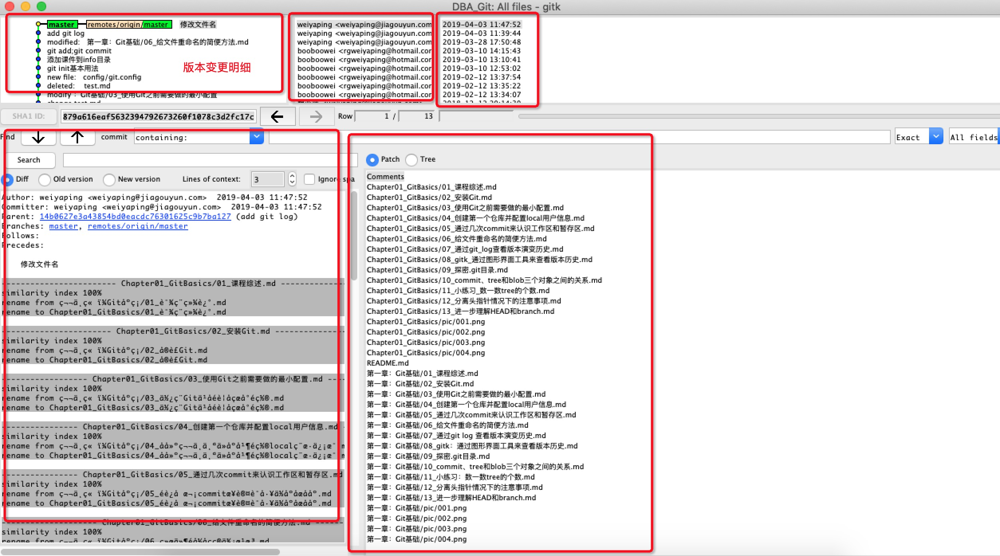

<!-- TOC depthFrom:1 depthTo:6 withLinks:1 updateOnSave:1 orderedList:0 -->

- [gitk通过图形化工具查看版本历史](#gitk通过图形化工具查看版本历史)
- [gitk问题总结](#gitk问题总结)

<!-- /TOC -->
# gitk通过图形化工具查看版本历史

```shell
gitk
```
通过该命令调用图形化界面，但是貌似不是很高清（Mac环境）。



# gitk问题总结


* gitk 后面可以跟上文件的路径，这样能看单个文件的修改历史的具体内容，非常有用；
* 似乎 gitk 对 utf-8 编码的中文字符支持存在一定的问题，在我的 IDE 上将中文注释全都变成乱码了；
* 推荐 gitkarken、sourcetree、tower 等等图形化工具；
* Mac 上升级自带版本的 Git 的方式，可以参考 StackOverFlow 上的这个问题：https://stackoverflow.com/questions/8957862/how-to-upgrade-git-to-latest-version-on-os-x
