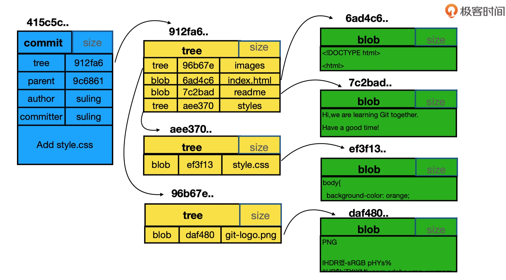

[TOC]
# commit、tree和blob三个对象之间的关系

1. 查看git日志，选择一个commit；

   ```
   MacBook-Pro-4:git_le booboo$ git log --oneline -n3
   f5634fd (HEAD -> master) modify 20190406
   f223b4d add 20190403.md
   c4744d9 add readme.md
   ```

2. 通过commit查看tree；

3. ```
   MacBook-Pro-4:git_le booboo$ git cat-file -p c4744d9
   tree 6f47cef9a80991888e82e73aa5b78f7a784f345e
   author weiyaping <weiyaping@jiagouyun.com> 1554261524 +0800
   committer weiyaping <weiyaping@jiagouyun.com> 1554261524 +0800
   
   add readme.md
   ```

4. 通过tree查看blob；

   ```
   MacBook-Pro-4:git_le booboo$ git cat-file -p 6f47cef9a8099
   100644 blob b302937d18a748f0e071c2c42712d2b18b0eeb1a	readme.md
   ```

5. 通过blob查看文件内容。

   ```
   MacBook-Pro-4:git_le booboo$ git cat-file -p b302937d1
   le
   ```

   

# 总结

