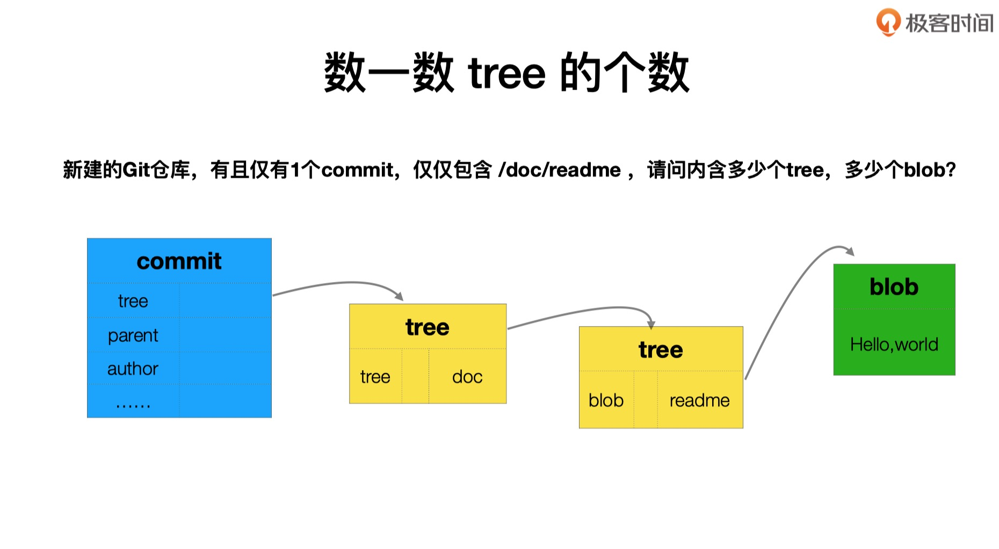

# 小练习_数一数tree的个数



```
MacBook-Pro-4:booboo booboo$ git init git-02
Initialized empty Git repository in /Users/booboo/Desktop/booboo/git-02/.git/
MacBook-Pro-4:booboo booboo$ cd git-02
MacBook-Pro-4:git-02 booboo$ mkdir doc
MacBook-Pro-4:git-02 booboo$ echo doc-test > doc/reamde
MacBook-Pro-4:git-02 booboo$ git add doc/reamde 
MacBook-Pro-4:git-02 booboo$ git commit -m 'new commit'
[master (root-commit) 8e42ad7] new commit
 1 file changed, 1 insertion(+)
 create mode 100644 doc/reamde
MacBook-Pro-4:git-02 booboo$ git log
commit 8e42ad75ce3c4ff53aade034168c51c2aaff7d41 (HEAD -> master)
Author: weiyaping <weiyaping@jiagouyun.com>
Date:   Thu Apr 11 21:25:30 2019 +0800

    new commit
MacBook-Pro-4:git-02 booboo$ git cat-file -p 8e42ad75ce3c
tree ba6c17b4b5c3cdc481e1c8a18bbf50cfd0e5c597
author weiyaping <weiyaping@jiagouyun.com> 1554989130 +0800
committer weiyaping <weiyaping@jiagouyun.com> 1554989130 +0800

new commit
MacBook-Pro-4:git-02 booboo$ git cat-file -p ba6c17b4
040000 tree 025501607b324923e813dbdaf2b4be564b817811	doc
MacBook-Pro-4:git-02 booboo$ git cat-file -p 02550160
100644 blob 017ed3172ed19828d91b55075785a94badf14f3e	reamde
MacBook-Pro-4:git-02 booboo$ git cat-file -p 017ed3172e
doc-test
```

| 过程   | commit         | tree                | tree                   | blob               |
| ------ | -------------- | ------------------- | ---------------------- | ------------------ |
| 哈希值 | `8e42`         | `ba6c`              | `0255`                 | `017e`             |
| 说明   | 提交的唯一`id` | 提交`doc`目录的`id` | 提交`readme`文件的`id` | `readme`的文件`id` |

