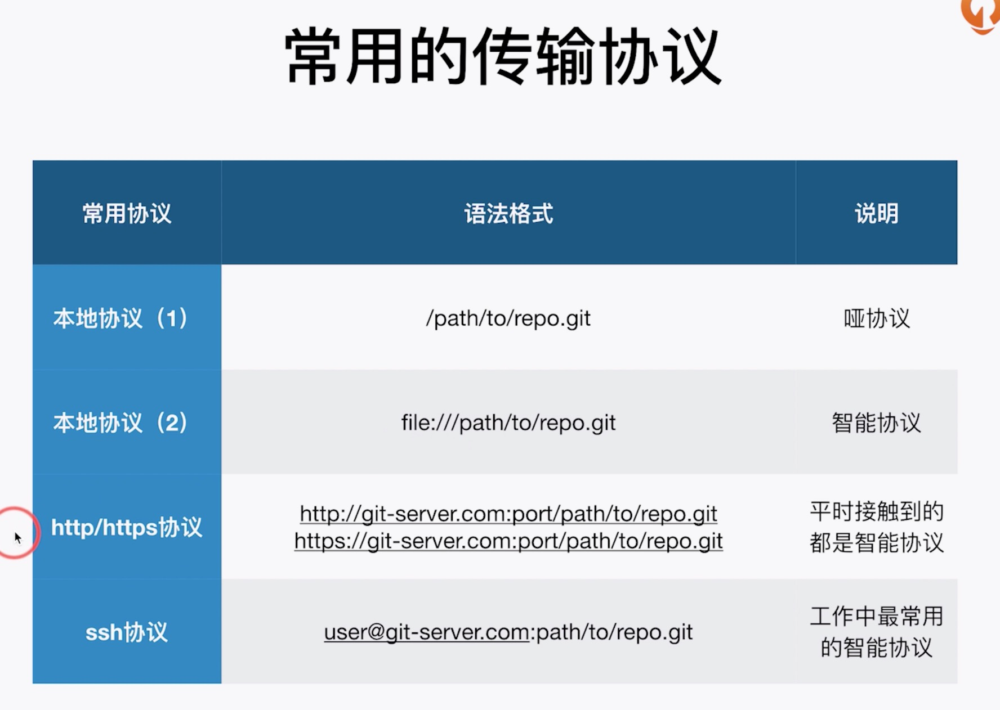
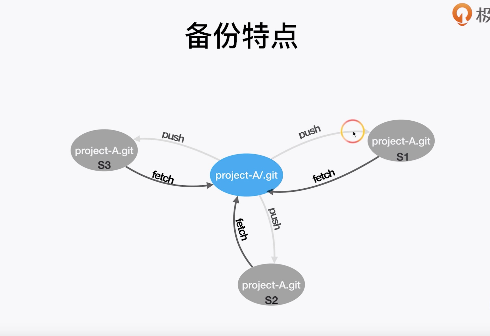

[toc]

# 如何将Git仓库备份到本地



哑协议 VS 智能协议

* 直观区别： 哑协议传输速度不可见、智能协议传输协议可见
* 传输速度：智能协议比哑协议传输速度块



```shell
mkdir backup_dir
cd backup_dir
git clone --bare file://[local_path] [backup_name]

cd git_dir
git remote add backup_name file://[local_path]

git push --set-upstream backup_name master
```
