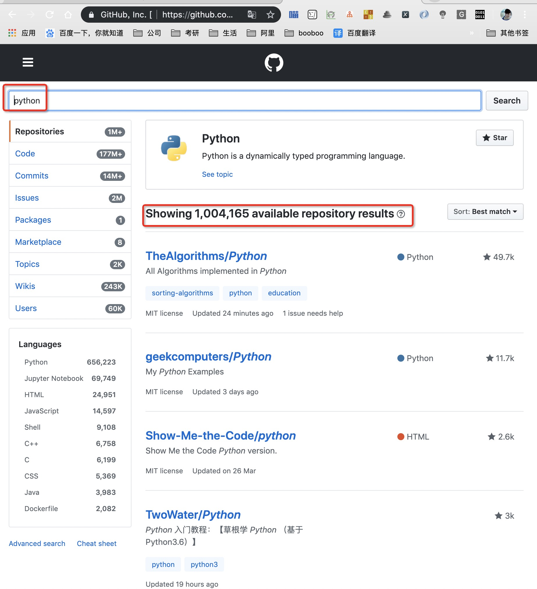
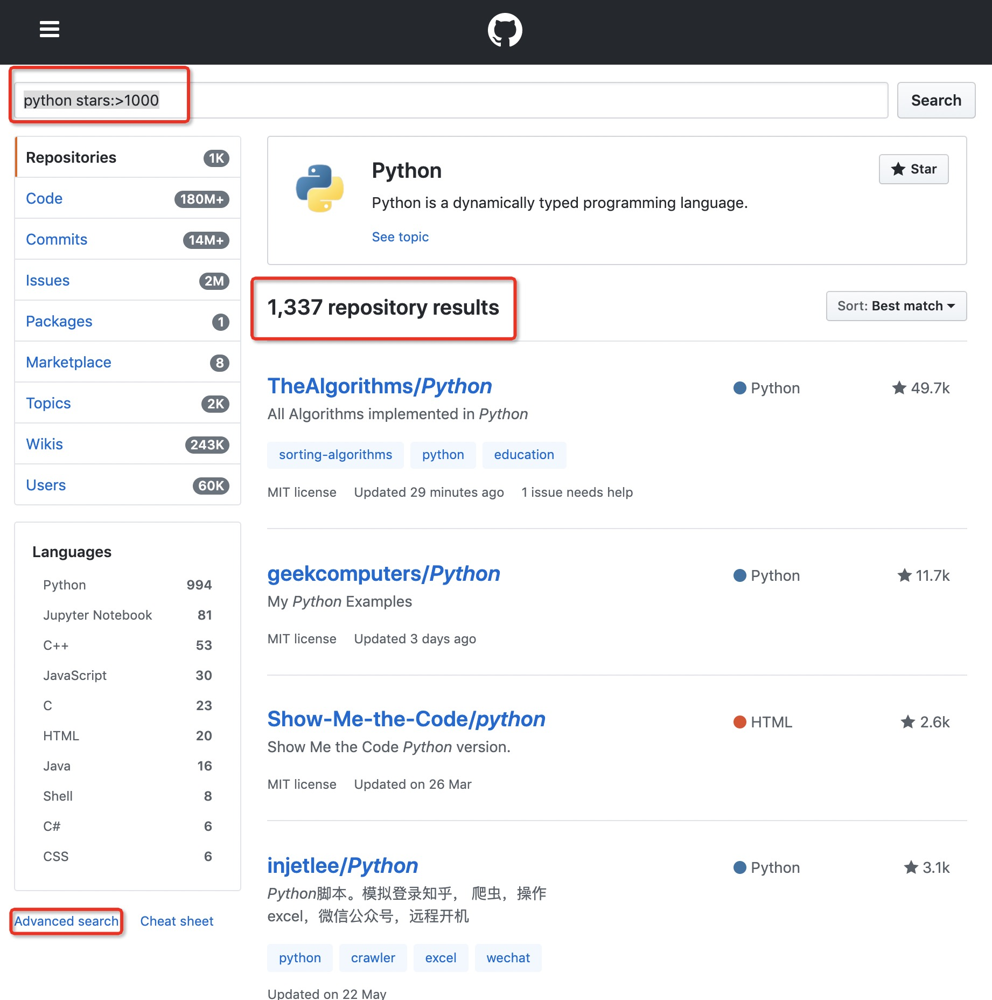
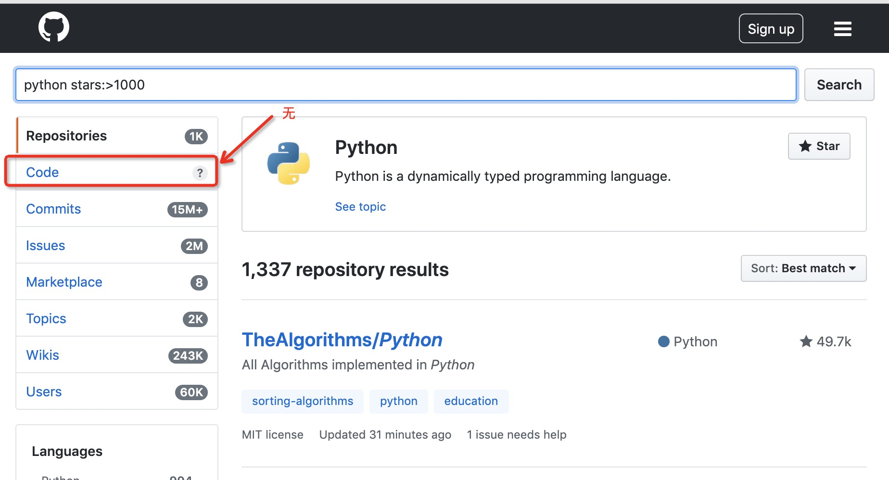

# 怎么快速淘到感兴趣的开源项目

## 一般搜索

直接在搜索框中填写关键字

例如：查找python相关的项目




## 高级搜索

[高级搜索URL](https://github.com/search/advanced?q=python)


 ```bash
 python stars:>1000 forks:50..1000 language:Python
 ```

 无结果

```shell
python stars:>1000
```



搜索的结果减少至1000左右。

注意：高级搜索功能显示code需要登陆才能使用


