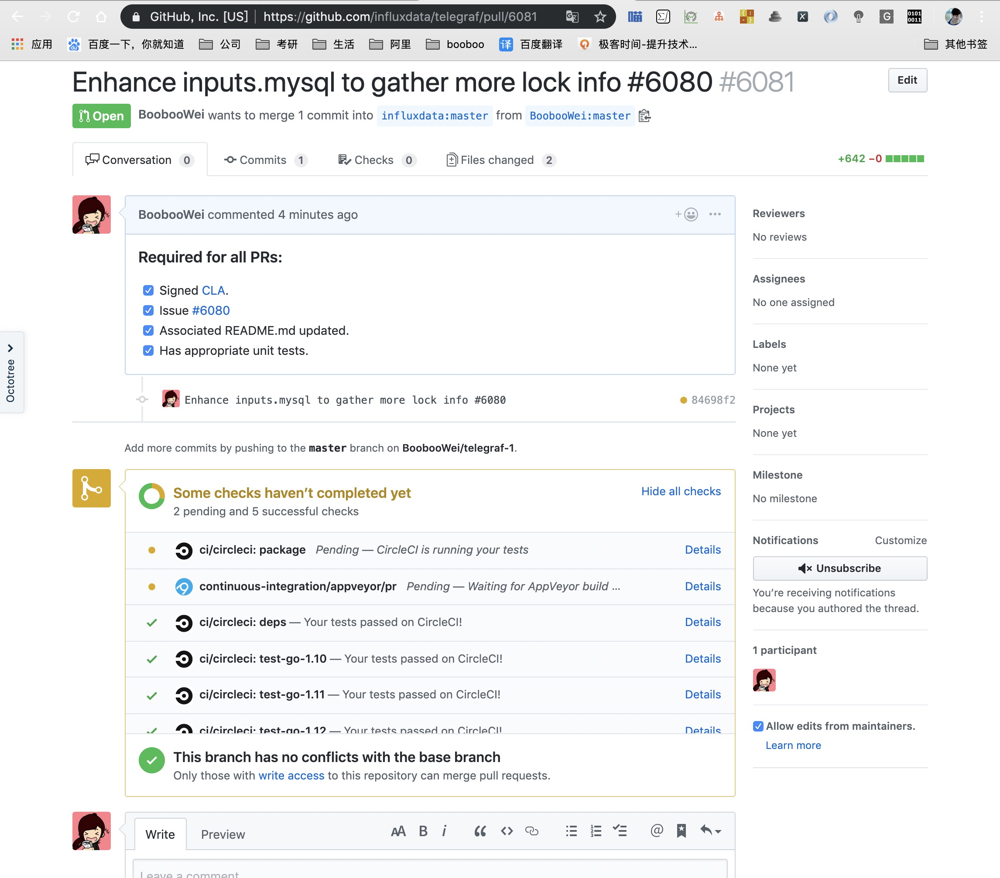

# 开源项目怎么保证代码质量

如何向开源项目提交request？

## 案例1-向InfluxData/telegraf开源项目提交PR

1. 访问telegraf项目的Readme，获取该项目的PR要求

[Readme](https://github.com/influxdata/telegraf)

2. 访问贡献步骤

[贡献步骤](https://github.com/influxdata/telegraf/blob/master/CONTRIBUTING.md)

```shell
Contributing
* Sign the CLA.
* Open a new issue to discuss the changes you would like to make. This is not strictly required but it may help reduce the amount of rework you need to do later.
Make changes or write plugin using the guidelines in the following documents:
* Input Plugins
* Processor Plugins
* Aggregator Plugins
* Output Plugins
* Ensure you have added proper unit tests and documentation.
* Open a new pull request.
```

3. 我的PR

[增强inputs.mysql以收集更多锁定信息＃6080 ](https://github.com/influxdata/telegraf/pull/6081)


